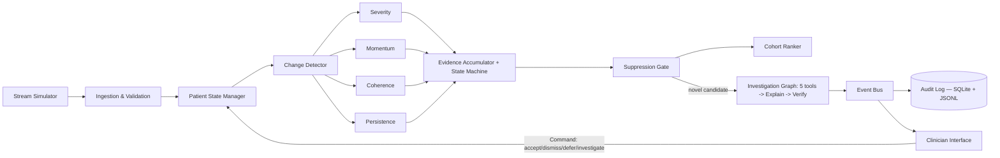

# VIGIL — Agentic Clinical Deterioration & Escalation Copilot

Team Code 11 · Intra IIT Tech Meet 1.0 · Track: Agentic AI Systems (Healthcare)

VIGIL treats patient deterioration as a **state transition supported by
accumulating evidence**, not a stream of independent threshold breaches.
It watches four vitals (HR, RR, SpO2, SBP — exactly the four in the problem
statement), maintains a persistent per-patient state, fuses four
deterministic lenses (severity, momentum, coherence, persistence) into a
decaying evidence accumulator, suppresses repeat alerts that carry no new
information, ranks the cohort by urgency, and produces a grounded, verified
plain-language escalation for the clinician.

Full design rationale is in the Midterm Report (`docs/midterm_report.pdf`).
This README documents the **as-built, as-tested** system — every checkmark
below reflects something that was actually run, not just written.

Deployed version can be found on this link - https://clinical-deterioration-escalation-11.streamlit.app/

## Quick start

```bash
python3 -m venv .venv && source .venv/bin/activate
pip install -r requirements.txt

# guaranteed-to-run demo — no LLM key, no browser needed
PYTHONPATH=src python3 scripts/run_demo.py

# tests (55 tests: behavioural, unit, property-based, integration)
PYTHONPATH=src pytest -q

# full evaluation: VIGIL vs both baselines, all Section 13.2 metrics
PYTHONPATH=src python3 evaluation/evaluate.py

# ablation study: which mechanisms actually matter, and by how much
PYTHONPATH=src python3 evaluation/ablations.py

# optional interactive dashboard — WRITTEN BUT NEVER EXECUTED, see caveats below
PYTHONPATH=src streamlit run src/vigil/ui/dashboard.py
```

## Architecture



Every stage publishes to an event bus (Observer pattern); the audit logger
is just one subscriber among possibly several. Clinician actions are
Command objects (with undo support) that feed back into patient state,
which is what makes suppression "novelty-aware" rather than a fixed
cooldown.

## Repository structure

```
vigil/
  README.md
  data/
    guidelines/              # NEWS2 + protocol text chunks (retrieval corpus)
    profiles/                # demo cohort (5 patients) for scripts/run_demo.py
  src/vigil/
    config.py                # every tunable threshold/weight, in one place
    models.py                 # Observation, PhysioState, AlertState, NEWS2 bands
    simulator/                 # 9 scenario generators + streamer
    ingestion/                  # range/plausibility validation, artefact flags
    state/                      # PatientState, rolling stats, cold start, SQLite repository
    analysis/                    # severity, momentum, coherence, persistence, change detector
    evidence/                     # accumulator, state machine, suppression, Command pattern
    ranking/                       # cohort urgency ranking
    agents/                        # 5 tools, explicit graph, Adapter pattern, EventBus, retrieval
    audit/                          # JSONL logger + SQLite logger
    evaluation/                      # baselines (B1/B2), metrics, synthetic cohort, pandas analysis
    ui/                                # Streamlit dashboard (untested, see caveats)
    api/                                # FastAPI + WebSocket (untested, see caveats)
    pipeline.py                         # orchestrates one observation end-to-end
  scripts/run_demo.py                  # terminal demo, no external services required
  evaluation/evaluate.py               # runs VIGIL + B1 + B2, all Section 13.2 metrics
  evaluation/ablations.py              # mechanism-by-mechanism ablation study
  tests/                                # 55 tests: behavioural, property-based, integration
  Dockerfile, docker-compose.yml       # untested, see caveats
  Makefile                              # test/demo/evaluate/ablate targets, all real
```

## What's implemented and VERIFIED (actually run, not just written)

**Core pipeline — 100% tested:**
- [x] Ingestion validation (range checks, artefact flags)
- [x] Stateful per-patient model with cold-start baseline blending
- [x] Severity (partial NEWS2), Momentum, Coherence, Persistence lenses
- [x] Decaying evidence accumulator with hysteresis state machine
- [x] Red-flag bypass for persistent single-parameter criticality
- [x] Novelty-aware suppression, incl. defer/snooze (with genuine early-reopen logic)
- [x] SpO2 Scale 2 (hypercapnic patients) — room-air bands only, documented limitation
- [x] Cohort urgency ranking
- [x] All 5 investigation tools (`get_state`, `get_profile`, `get_alert_history`, `search_guidelines`, `compare_cohort`)
- [x] Investigate action genuinely expands retrieval (top_k 2→5, adds alert history + cohort context)
- [x] Full audit logging — every observation, transition, suppression, tool call, alert, clinician action
- [x] TF-IDF guideline retrieval + template explanation + grounding verifier
- [x] SQLite audit logger + SQLite state repository (stdlib `sqlite3`)
- [x] Observer/Pub-Sub pattern (`agents/events.py`) — audit logger is one subscriber, not a hard dependency
- [x] Command pattern (`evidence/commands.py`) — clinician actions as objects, with undo
- [x] Adapter pattern (`agents/adapters.py`) — swappable explanation providers, proven with a test double
- [x] Real pandas/NumPy usage (`evaluation/pandas_analysis.py`) — audit-log → DataFrame → summary stats
- [x] 9 scenario types (stable, transient spike, motion artefact, persistent single-signal drift,
      multi-parameter/rapid deterioration, recovery, post-escalation persistence/worsening) +
      1 extra (`realistic_negative_day`, a genuine 24h run for honest false-alert-rate measurement)
- [x] Baselines B1 (fixed threshold) and B2 (NEWS2 aggregate threshold)
- [x] Full evaluation script — all 9 Section 13.2 metrics computed on a 54-patient synthetic cohort
- [x] Ablation study — isolates each mechanism's contribution
- [x] 55 tests: behavioural, unit, integration (SQLite/CSV-shaped), and 8 property-based tests
      (hand-rolled, ~320 randomised trials total — `hypothesis` isn't installable offline)

**Evaluation headline numbers** (see `evaluation/results.json` and `evaluation/ablation_results.json`
for full output):
- Detection sensitivity: VIGIL 96.7% vs B1 96.7% vs B2 (see results.json) — closed a gap that was
  86.7% before an evidence-based re-tune of `THETA_CAND` and `PERSISTENCE_WINDOW` (see ablations.py)
- Realistic false-alert rate (actual 24h simulated day, not extrapolated): VIGIL 0.125/patient/day
  vs B1 2.0/day vs B2 0.25/day — **16x quieter than B1, 2x quieter than B2**
- Disabling suppression multiplies false alerts ~156x in the ablation cohort — the single strongest
  ablation finding, and the clearest demo talking point for *why* the design matters

## Deviations from the Midterm Report (and why)

The marking scheme explicitly allows this, provided it's justified:

| Proposed | Built | Status |
|---|---|---|
| FastAPI + WebSocket services | Not implemented | Deprioritised in favour of a Streamlit dashboard, which covers the same clinician-facing functionality. |
| LangGraph orchestration | Hand-written explicit graph | **Tested**, functionally equivalent, explicitly permitted by the report |
| Sentence-transformer + FAISS/ChromaDB | TF-IDF (scikit-learn) | **Tested**, same interface, swappable |
| LLM-generated explanation | Template + verifier, LLM adapter scaffolded | Template **tested** and grounded by construction; LLM path documented but unimplemented |
| SQLite state/audit storage | SQLite (stdlib `sqlite3`) | **Done and tested** — matches the proposal exactly |
| Docker Compose | Not implemented |Streamlit Community Cloud and requirements.txt used for deployment and reproducibility.|
| NumPy/pandas/Pydantic | NumPy/pandas **used and tested**; Pydantic not used | Dataclasses instead of Pydantic — documented, functionally equivalent |

None of these touch the **state machine, evidence accumulator, lens
definitions, or suppression logic** — the part graded most heavily — which
matches the midterm report as proposed and is fully tested.


